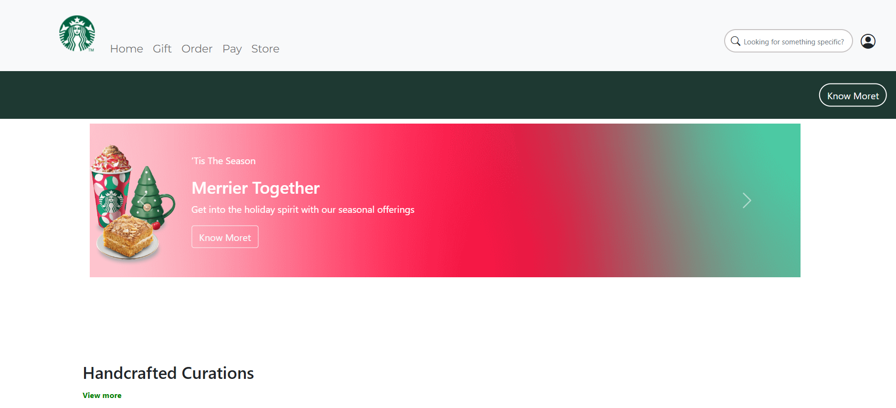
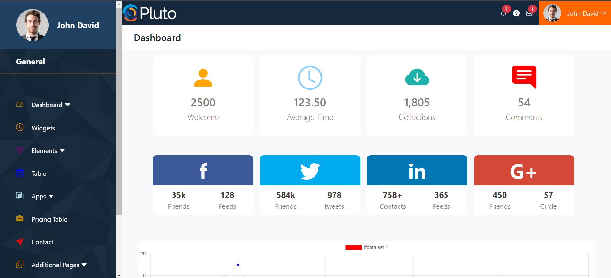

# 🌐 Responsive Website using HTML, CSS & Bootstrap

This project is a fully responsive website built with **HTML5**, **CSS3**, and **Bootstrap 5**.  
It demonstrates how to build modern, mobile-friendly websites using the Bootstrap framework.

## 🎯 Project Objective

To create a beautiful and responsive front-end website using core web technologies and Bootstrap's powerful grid and component system.

## ✨ Features

- 🖼️ Fully responsive design
- 🧭 Navigation bar with dropdown support
- 📱 Mobile-first layout using Bootstrap Grid
- 💻 Clean and modern UI
- 🎨 Reusable components like cards, buttons, modals, etc.

## 🛠️ Tech Stack

- ✅ HTML5  
- ✅ CSS3  
- ✅ Bootstrap 5 (via CDN)  
- ❌ No JavaScript (Optional for interactivity)

 
# ☕ Starbucks Website Clone using HTML, CSS & Bootstrap

This is a responsive front-end clone of the **Starbucks** homepage, built using **HTML5**, **CSS3**, and **Bootstrap 5**.  
Designed to look clean and modern with fully responsive layout using Bootstrap components and grid system.

## 🎯 Project Objective

To replicate the layout and style of the Starbucks website using HTML, CSS, and Bootstrap —  
with a focus on layout design, responsiveness, and UI consistency.

## ✨ Features

- ✅ Responsive Navbar with brand logo
- 🎯 Hero banner with call-to-action
- 🍵 Featured drinks or sections
- 📱 Mobile-friendly layout using Bootstrap Grid
- 🌐 Clean, professional design using Bootstrap utilities

## 🛠️ Tech Stack

- HTML5  
- CSS3 (Custom styles)  
- Bootstrap 5 (via CDN)  
- No JavaScript required (for basic layout)

 
# 🛠️ Admin Panel using HTML, CSS & Bootstrap

A responsive **Admin Dashboard UI** built using **HTML5**, **CSS3**, and **Bootstrap 5**.  
This template is ideal for managing user data, viewing analytics, or integrating with backend systems.

## 🎯 Project Objective

To design a professional and fully responsive Admin Panel layout using only front-end technologies.  
It includes a sidebar menu, dashboard content area, responsive cards, and Bootstrap utilities.

## ✨ Features

- 📊 Dashboard layout with sidebar and main content
- 🎨 Clean UI with Bootstrap styling
- 📱 Fully responsive for mobile and desktop
- 🧭 Sidebar navigation with icons
- 💡 Reusable card and table components

## 🛠️ Tech Stack

- ✅ HTML5  
- ✅ CSS3 (with custom styling)  
- ✅ Bootstrap 5 (via CDN)  
- ❌ No backend (UI only)

